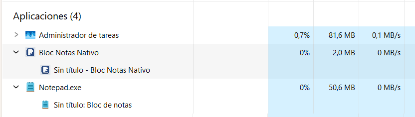

# Native Notes Pad 📝

[English] | [Español](README.es.md)

[](https://opensource.org/licenses/MIT)


An extremely fast, lightweight, and native notepad for Windows written in **Rust**. 
Designed to be a modern, efficient, and minimalist alternative to the classic Windows Notepad, featuring enhanced zoom, multilingual support, and ultra-low resource consumption.

(Sorry of this image of the task manager in spanish)



## 📥 Download

Get the latest pre-compiled version (ready-to-use `.exe`) from the following platforms:

👉 **[Download from Itch.io - Pay what you want] (https://mariolobato.itch.io/native-notes-pad)**
👉 **[Download from ko-fi.com - Pay what you want] (https://ko-fi.com/s/9595386605))**


---

## ✨ Features

- 🚀 **Super Lightweight**: Written in Rust using native Windows APIs (Win32).
- 🔒 **Absolute Privacy & Security**: No telemetry, no bloatware. Not a single data point or statistic is collected. It does **not** connect to the Internet.
- ⚡ **Extreme Performance**: Minimal RAM consumption, typically using only **1.8 MB to 2 MB** of memory.
- 🚫 **No Bloatware**: No background updates or unnecessary resource-consuming features.
- 🌍 **Multilingual**: Support for English and Spanish (switchable in real-time). More languages coming soon.
- 🔍 **Integrated Zoom**: Adjust font size easily with `Ctrl` + `+` / `Ctrl` + `-` or by using `Ctrl` + `Mouse Wheel`.
- 🔄 **Word Wrap**: Toggle text wrapping with a single click.
- 🎨 **Font Customization**: Choose any typography installed on your system.
- 💾 **UTF-16 & ASCII Support**: Native handling of multiple encoding formats to ensure compatibility with special characters.
- 🖥️ **Windows Native**: Specifically optimized for Windows 10 and Windows 11.

## 🛠️ Build from Source

If you prefer to compile the project yourself, make sure you have [Rust and Cargo](https://www.rust-lang.org/tools/install) installed.

1. Clone this repository:
   ```bash
   git clone https://github.com/mariolobato/native_notes_pad.git
   cd native_notes_pad
   ```

2. Build the project in **Release** mode for an optimized executable:
   ```bash
   cargo build --release
   ```

3. The executable will be located at:
   ```
   target/release/native_notes_pad.exe
   ```

## ❤️ Support the Project

This project is open-source and free to use. If you find it helpful, consider buying me a coffee or making a small donation to support further development:

- [Support on Ko-fi](https://ko-fi.com/mariolobato)

Thank you for using Native Notes Pad!
